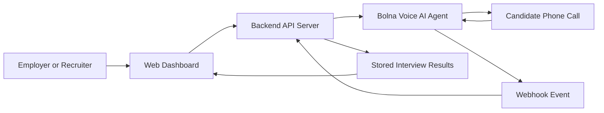
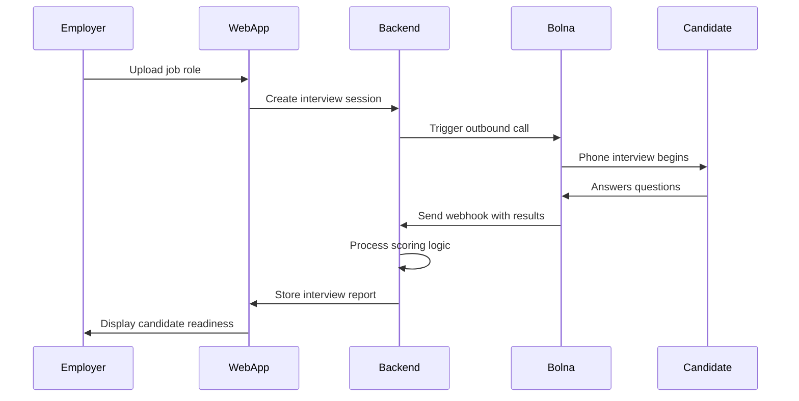

# Field Technician Job-Ready Voice Coach

A **voice-based AI coaching system** that prepares blue-collar workers for job interviews through automated phone calls.

The system calls a candidate, conducts a short voice interview in their preferred language (**Hindi or English**), evaluates their responses, and produces a **coaching report with strengths, weaknesses, and improvement tips**.

Results are displayed in a **web dashboard** for employers, training organizations, or workforce platforms.

This project demonstrates how **conversational AI can improve workforce readiness** using **Bolna's voice AI infrastructure**.

---

# Why This Problem Matters

India has over **450 million blue-collar workers**, and a large portion of new gig workers come from **tier-2 and tier-3 cities**.

Many of these workers face two major barriers when trying to access jobs:

* Language barriers
* Lack of interview preparation

Most job preparation tools assume that workers are comfortable with **written English, smartphones, and online forms**.

In reality, many workers are far more comfortable interacting **through voice rather than text**.

Voice-based coaching removes these barriers.

Workers can receive **preparation calls in their preferred language** and get **immediate feedback on their readiness for a job**.

This project focuses on **field technician roles** (electricians, technicians, etc.), where structured interview preparation can significantly improve hiring outcomes.

---

# Inspiration

The concept is inspired by **Vahan.ai**, which places over **40,000 gig workers per month** through voice-based AI assistants for companies like Swiggy, Zomato, Blinkit, and Zepto.

However, Vahan focuses primarily on **recruitment**.

This project explores the **missing layer: interview coaching and preparation**.

Instead of only matching workers to jobs, the system helps them **become ready for the interview itself**.

---

# Key Features

### Voice-First Interaction

Candidates interact entirely through a **phone call**.

No mobile app or typing is required.

### Multilingual Conversation

The agent automatically switches between **Hindi and English** depending on candidate preference.

### AI Interview Simulation

The system asks **role-specific interview questions** to evaluate job readiness.

### Automated Coaching Feedback

Candidates receive **personalized improvement tips** after the interview.

### Structured Result Dashboard

Interview results are **stored and visualized through a web interface**.

### End-to-End Automation

The entire process from **call initiation → interview → scoring → dashboard results** is fully automated.

---

# System Architecture



---

# End-to-End Flow Diagram



---

# Employer Dashboard


Shows the **candidate pipeline and interview status**.

### What it shows
    
* Total candidates
* Calls completed
* Calls in progress
* Average score
* Interview readiness status

Employers can monitor **all candidates in one place**.

---

# Add Candidate Page


Employers register candidates for **voice coaching calls**.

### What happens

* Employer enters candidate details
* Candidate is added to the dashboard
* AI call can be triggered instantly
* The agent automatically detects the candidate’s preferred language

---

# Interview Results

Detailed **coaching report** generated after the AI call.

### The system extracts structured insights:

* Candidate strengths
* Areas for improvement
* Coaching advice
* Language used
* Interview completion status

This helps employers **quickly evaluate job readiness**.


---

# Project Structure

```
skillbridge/

├── bolna-config/
│   ├── system-prompt.txt
│   ├── score-interview-function.json
│   └── extraction-prompt.txt
│
├── backend/
│   ├── server.js
│   ├── package.json
│   └── .env.example
│
└── web-app/
    ├── src/
    │   ├── App.jsx
    │   ├── App.css
    │   ├── index.css
    │   ├── lib/
    │   │   └── api.js
    │   └── pages/
    │       ├── Dashboard.jsx
    │       ├── AddCandidate.jsx
    │       └── Results.jsx
    │
    ├── index.html
    ├── vite.config.js
    └── package.json
```

---

# Quick Start (Local Development)

## Terminal 1 — Backend

No dependency installation required.

```bash
cd skillbridge/backend
cp .env.example .env
```

Edit `.env` and add:

```
BOLNA_API_KEY=your_api_key
BOLNA_AGENT_ID=your_agent_id
```

Start the backend:

```bash
node server.js
```

You should see:

```
SkillBridge backend running → http://localhost:3001

POST /api/candidates
GET  /api/candidates
GET  /api/stats
POST /api/trigger-call
```

---

## Terminal 2 — Frontend

```bash
cd skillbridge/web-app
npm install
npm run dev
```

The frontend will open at:

```
http://localhost:5173
```

The Vite dev server automatically proxies:

```
/api/* → localhost:3001
```

---

# Exposing Your Backend Publicly (Required for Bolna)

Bolna must access your backend via a **public URL**.

### Option 1 — Using ngrok

```bash
npx ngrok http 3001
```

Example output:

```
https://abcd-1234.ngrok-free.app
```

Use this URL in:

* Bolna **Webhook URL**
* Bolna **Tools API URL**

---

# Scoring Logic

The `score_interview` custom function is called by Bolna during the call.

| Answer Quality | Points |
| -------------- | ------ |
| Excellent      | 25     |
| Good           | 20     |
| Average        | 12     |
| Poor           | 5      |

Confidence bonus:

| Confidence | Bonus |
| ---------- | ----- |
| High       | +10   |
| Medium     | +5    |
| Low        | +0    |

Maximum score: **100**

---

# Readiness Grades

| Score  | Grade | Readiness                 |
| ------ | ----- | ------------------------- |
| 80–100 | A     | Interview Ready           |
| 60–79  | B     | Almost Ready              |
| 40–59  | C     | Needs More Practice       |
| 0–39   | D     | More Preparation Required |

---

# API Reference

| Method | Endpoint                 | Purpose                     |
| ------ | ------------------------ | --------------------------- |
| GET    | `/api/stats`             | Dashboard summary           |
| GET    | `/api/candidates`        | List all candidates         |
| POST   | `/api/candidates`        | Add candidate               |
| POST   | `/api/trigger-call`      | Start outbound call         |
| POST   | `/api/score-interview`   | Called by Bolna during call |
| POST   | `/api/webhook`           | Receives call results       |
| GET    | `/api/results`           | All interview results       |
| GET    | `/api/results/:call_sid` | Single result               |

---

# Bolna Documentation References

* Custom Functions
  https://www.bolna.ai/docs/tool-calling/custom-function-calls

* Outbound Calls
  https://www.bolna.ai/docs/making-outgoing-calls

* Webhooks
  https://www.bolna.ai/docs/polling-call-status-webhooks

* Structured Data Extraction
  https://www.bolna.ai/docs/call-details

* Context Variables
  https://www.bolna.ai/docs/using-context

* Multilingual Support
  https://www.bolna.ai/docs/customizations/multilingual-languages-support

---

# License

This project is provided for **educational and demonstration purposes**.
